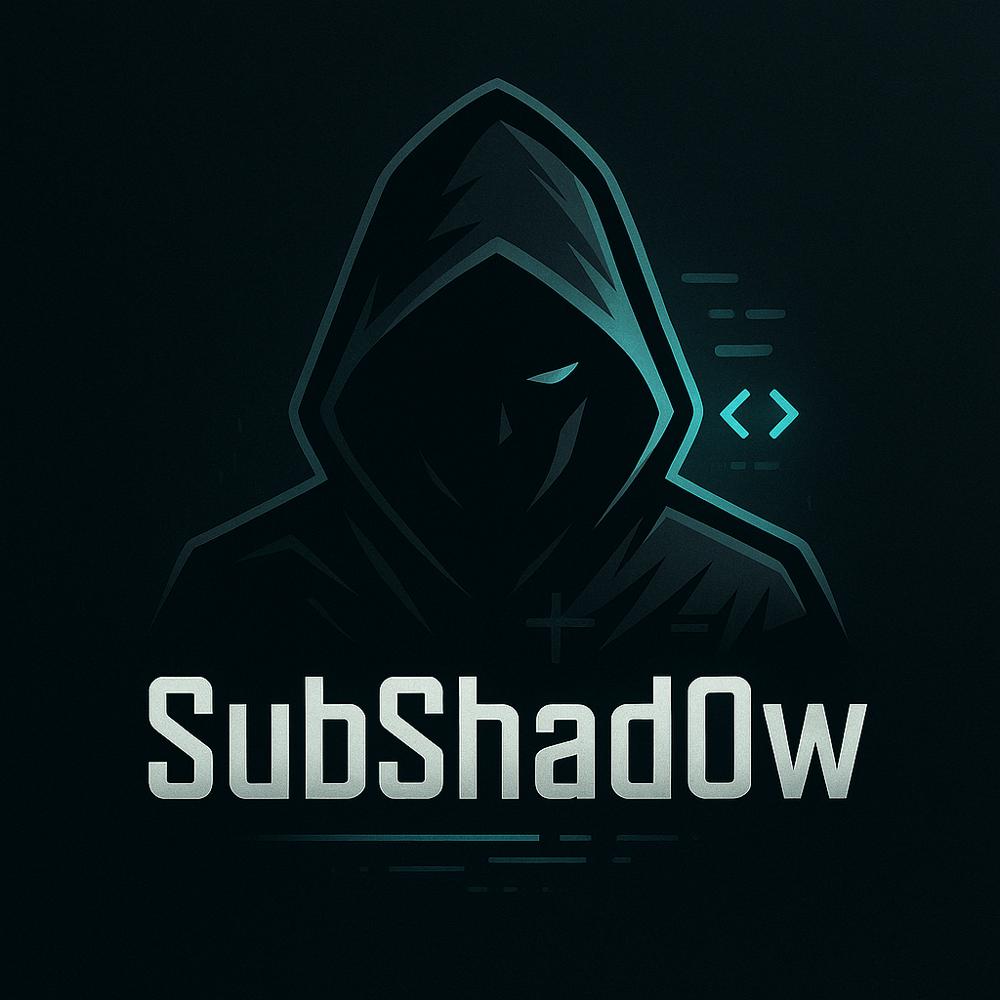

# ⚔️ SubShad0w




**SubShad0w** is a Python-based subdomain takeover detection tool.

SubShad0w is an advanced subdomain takeover detection tool designed to help bug bounty hunters, penetration testers, and security professionals identify vulnerable subdomains pointing to deprovisioned services. It automates the discovery and analysis of DNS records and response patterns by checking HTTP responses and resolving CNAME records.

---

## 📦 Requirements

- Python 3.8+
- [`httpx`](https://github.com/projectdiscovery/httpx) (binary)
- Python packages:
  - `requests`
  - `urllib3`
  - `dnspython`

---

## 🔧 Installation

### 1. Clone the repository
```bash
git clone https://github.com/yourusername/SubShad0w.git
cd SubShad0w
pip install -r requirements.txt --break-system-packages


### Or using a virtual environment:

python3 -m venv venv
source venv/bin/activate
pip install -r requirements.txt
```

## 🚀 Usage

### 1. Create a target list

Create a file named **targets.txt**  with one domain per line:
```
example.com
testsite.net
```

### 2. Run the tool

```
python3 subshad0w.py -l targets.txt
```


## 📁 Output

All results will be saved in the Output/ directory:

    subdomains.txt – All filtered subdomains

    LiveDomains.txt – Subdomains that responded

    4XX.txt – Subdomains returning 404 or empty responses

    cname.txt – CNAMEs that may indicate takeover opportunity
